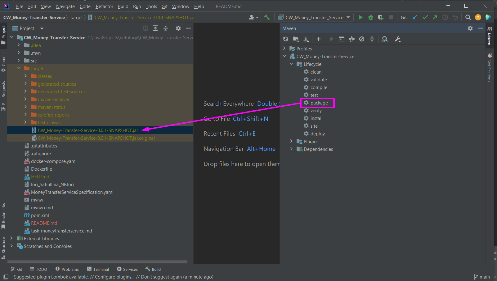
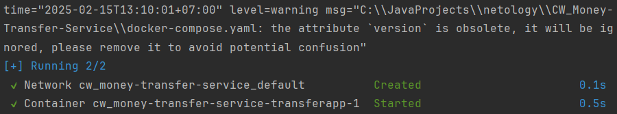

# Курсовой проект «Сервис перевода денег»

Описание и требования к проекту: [задание](https://github.com/NataliaSafiullina/CW_Money-Transfer-Service/blob/main/task_moneytransferservice.md)

## Запуск проекта

1. Упаковать проект и получить jar-файл

2. Собрать docker образ

+ В терминале находясь в корне проекта выполнить команду:

>docker build -t transferapp:latest -t transferapp:1.0 . 

+ Получим образ с именем transferapp

3. Запустить контейнер

+ В терминале находясь в корне проекта выполнить команду:

>docker-compose up -d

+ Терминал выведет сообщение, что контейнер запущен

+ Приложение запущено!
+ Приложение использует порт 5500.

## Работа с приложением

1. В качестве FRONT можно использовать развёрнутое демо-приложение [по адресу](https://serp-ya.github.io/card-transfer/).

2. Проверка работы приложения из **Postman**

+ Отправим запрос на перевод денег

POST http://localhost:5500/transfer

Body, raw, JSON:

>{
> 
>    "cardFromNumber": "1111111111111111",
>
>    "cardToNumber": "2222222222222222",
> 
>    "cardFromCVV": "111",
> 
>    "cardFromValidTill": "12/56",
>
>    "amount": {
> 
>        "currency": "RUR",
> 
>        "value": 100
> 
>   }
> 
>}

При успешном выполнении запроса, получим ответ:

**200 OK**

Body:

>{
    "operationId": "2"
}

где 2 - это номер операции.

+ Теперь отправим запрос на подтверждение операцию с указанным номером

POST http://localhost:5500/confirmOperation

>{
>
>  "operationId": "2",
>
>  "code": "999"
>
>}

При успешном выполнении запроса, получим ответ:

**200 OK**

Body:

>{
    "operationId": "3"
}

